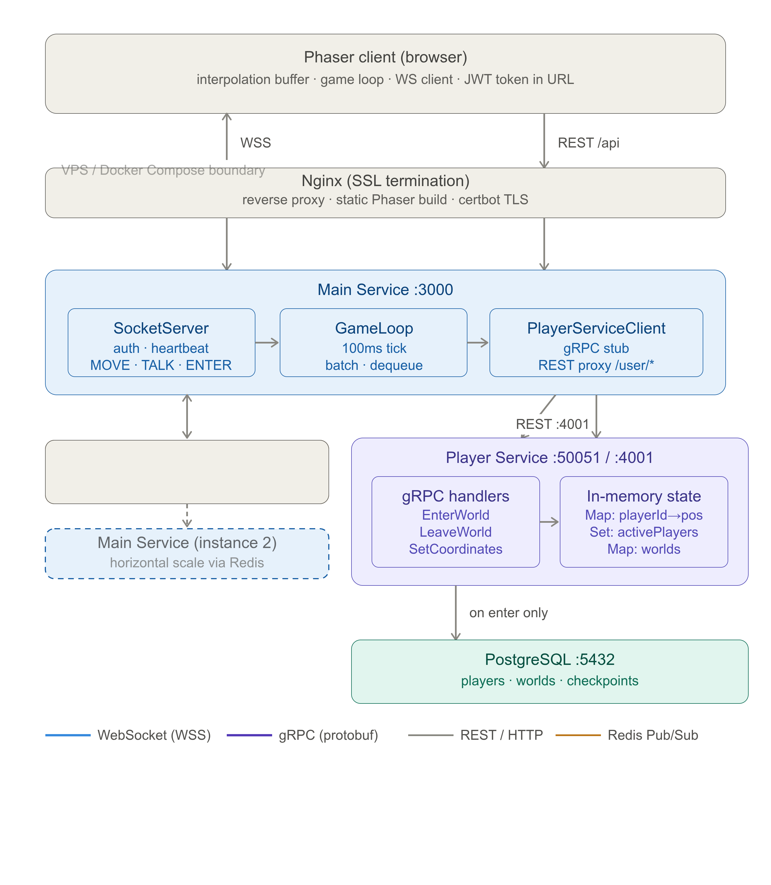

# Gather_u

A real-time multiplayer RPG game built with modern web technologies, featuring character selection, world exploration, and live player interactions.

## 🎮 Overview

Gather_u is a browser-based multiplayer RPG where players can create characters, explore different worlds, and interact with other players in real-time. The game features a retro pixel art style with 16x16 character sprites and tile-based environments.

## 🏗️ Architecture

The current codebase is split into three runnable parts:



### Client (`/client`)

- **Framework**: Svelte + TypeScript + Vite
- **Game Runtime**: Phaser.js for 2D rendering, movement, and scene logic
- **Responsibilities**: UI, game screens, asset loading, and WebSocket connection handling

### Main Service (`/mainService`)

- **Runtime**: Node.js + TypeScript
- **Web Framework**: Express.js for HTTP endpoints
- **Real-time Layer**: WebSocket server for live player state and chat
- **Coordination**: Redis pub/sub for cross-instance message fan-out and a game loop for movement updates
- **Auth Flow**: Issues and verifies player session tokens before allowing socket connections
- **API Role**: Proxies `/user` requests to the player service REST API

### Player Service (`/playerService`)

- **Runtime**: Node.js + TypeScript
- **Web Framework**: Express.js for user, auth, and player REST endpoints
- **RPC Layer**: gRPC service for player/world operations used by the main service
- **Persistence**: Database-backed user, player, and world models
- **Auth Flow**: Issues user tokens and player tokens for game access

### Service Boundaries

- The client talks to the main service over HTTP and WebSocket.
- The main service talks to the player service over REST for user data and over gRPC for player/world operations.
- Redis is used by the main service to forward gameplay events between running instances.


## 🚀 Features (In Development)

- **Character System**: Multiple character classes with unique sprites
- **World Exploration**: Tile-based maps with collision detection
- **Real-time Multiplayer**: Live player movement and interactions
- **User Management**: Player authentication and character persistence
- **Responsive UI**: Modal-based interface for game interactions

## 🛠️ Tech Stack

| Component   | Technology                      |
| ----------- | ------------------------------- |
| Frontend    | Svelte, TypeScript, Phaser.js   |
| Backend     | Node.js, Express.js, TypeScript |
| Real-time   | WebSockets (ws library)         |
| Database    | Redis                           |
| Build Tools | Vite, TSC                       |
| Development | Hot Module Replacement (HMR)    |

## 📁 Project Structure

```
Gather_u/
├── client/                 # Svelte + Phaser frontend
│   ├── assets/             # Game art, maps, and UI assets copied into builds
│   ├── public/             # Static public files
│   ├── src/
│   │   ├── lib/           # API and WebSocket helpers
│   │   ├── scripts/       # Scene, asset, and player logic
│   │   └── types/         # Global TypeScript declarations
│   ├── package.json
│   ├── svelte.config.js
│   └── vite.config.ts
├── mainService/            # HTTP + WebSocket game coordinator
│   ├── proto/              # Shared gRPC definitions
│   ├── src/
│   │   ├── lib/           # Auth, Redis, WebSocket, and game loop helpers
│   │   └── index.ts       # Main HTTP server entrypoint
│   ├── package.json
│   └── tsconfig.json
└── playerService/          # User, player, and world backend
    ├── proto/              # gRPC definitions
    ├── src/
    │   ├── lib/           # Database and gRPC server helpers
    │   ├── middlewares/   # Auth/session middleware
    │   ├── models/        # Data models
    │   ├── routes/        # REST routes
    │   └── index.ts       # Service entrypoint
    ├── package.json
    └── tsconfig.json
```

## 🎨 Assets

The game uses Creative Commons licensed 16x16 pixel art sprites for characters, providing a nostalgic retro gaming experience. Map tiles and UI elements follow the same aesthetic.

## 🔧 Development Status

This project is currently in active development. Core systems being implemented include:

- ✅ Basic client-server communication
- ✅ Character sprite rendering
- ✅ WebSocket connection handling
- ✅ Player movement and physics
- 🔄 User authentication
- 🔄 Scaling
- ⏳ World persistence
- ⏳ Combat system
- ⏳ Inventory management
- ⏳ Chat system

## 🚦 Getting Started

### Development

Install dependencies in the root and each package, then start the three services together from the repository root:

```bash
yarn dev
```

Alternative environment presets are available with:

```bash
yarn dev:s2
yarn dev:s3
```

Default local ports:

- Client: `5173`
- Main service: `3001`
- Player service HTTP: `4001`
- Player service gRPC: `50051`

The variant scripts shift those ports to avoid conflicts when running multiple environments side by side.

### Docker

The main service, player service, and Redis can also run inside one container. Build the backend image with:

```bash
yarn docker:build
```

Then run it with the ports exposed for the main HTTP API, player REST API, and gRPC API:

```bash
yarn docker:run
```

The container expects the same runtime secrets and infrastructure as the local services, including `JWT_SECRET`. Redis is started locally inside the container and the main service defaults to `127.0.0.1:6379`.

## 📄 License

This project uses various assets under Creative Commons licenses. See individual asset directories for specific licensing information.

---

_This project is a work in progress. Features and documentation will be updated as development continues._
